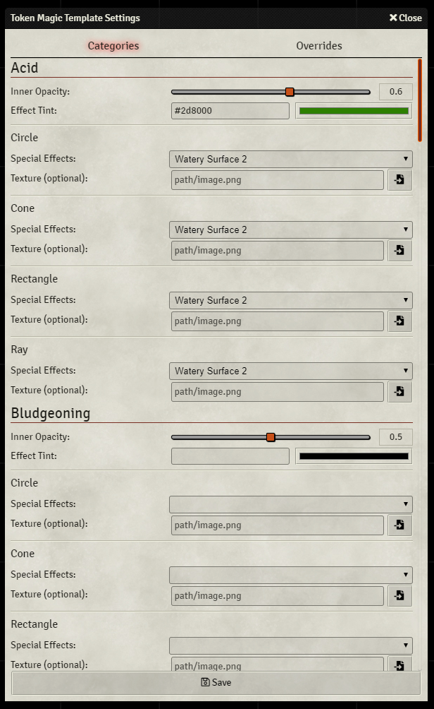
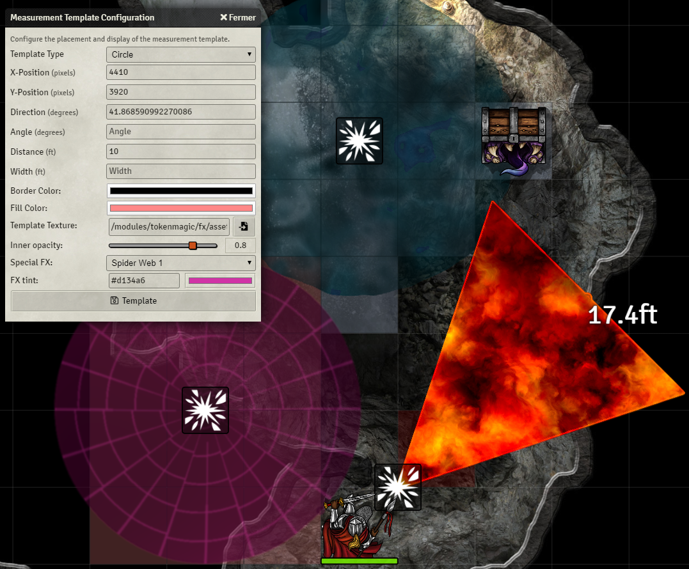

# Token Magic FX - Update v0.5.0-beta

First of all, I want to thank dev7355608 for his incredible contribution to this release!
Long live to dev7355608!

*New filter :*
- Sprite filter (beta) : to link sprites and manipulate them (color, translation, rotation, etc.)
- The token magic compendium has been updated with 3 new sprite filter macro

*Added/Changed :*
- An effect selector macro has been added to the token magic compendium, it works in tandem with any TMFX compendium (many thanks to Bruno Calado!)
- New automatic framerate setting to "release the kraken!"
- New automatically hide template effects setting that hides the border of textured templates.
- New sticky property. If set to true, the filter effect rotates with the target.
- The anchor point (anchorX/anchorY) isn't changed by other filters anymore.
- Default template on hover now shows the grid highlight when hovering over the template and not only when hovering over the control icon on the template layer.
- LibWrapper compatibility.
- The Korean language support : many thanks to KLO!
- The Chinese language support : many thanks to Zeteticl!
- Updated PIXI community filters
- A lot of framework improvements!

*Fixed Issues :*
- Filters were not working properly if the target was rotated.
- Distortion and Blur filters were not working properly when zooming in/out.
- Token Magic was not working if a route prefix was set.
- Some filters were not working properly on some MacOs and Linux distributions. 
- And a lot of other small fixes!

# Token Magic FX - Update v0.4.4-alpha (Mess edition PART I)

*News :*
- Integration of Mess Moerill's Supersuit(e) (for templates) part I :
  - Video support in templates :
    - You can set webm, mp4, etc. as video texture.
    - You can define videos in the automatic spell templates options (for dd5 only).
  - Texture autoresize :
    - The choosen texture is resized to fit the template.
- TMFX now supports the Spanish language! 

Many thanks to Lozalojo (Spanish translation) and Moerill (video) for this release!

*Fixed Issues :*
- Template effect tint was badly formatted during an automatic template creation.

# Token Magic FX - Update v0.4.3-alpha

*News :*
- Polymorph effect :
    - Allow image transition between a source image (token, tile, etc.) and a target image of your choice.
    - 9 types of transition are provided :
      - Morphing, waterdrop, waving, twisting, take off/put on your disguise!, tvnoise, hologram, wind and basic alpha transition.
    - Properties to reduce or enlarge the target image.
- XFire effect :
    - A fire filter with advanced properties, designed to be easily colorizable.
    - specific blend modes that do not alter the visual quality of the filter depending on the brightness and intensity of the source image.
    - An advanced mode allows you to choose up to 4 colors to compose your perfect fire.
    - An inlay mode to create new effects, like superfrost or superheat.
    - A chromatic mode.
    - Adjustable scale on the x and y axis.
- New macros have been added to the TMFX compendium (+ new presets for main library and templates)
- Added two new `animType` :
    - `halfCosOscillation` and `halfSinOscillation` :
      - The half of the given oscillation in one loop.
      - A tutorial is provided in the following macro : "36 - T01 - Turn into Mystery Man (polymorph)"

*Updates :*
- Rank your effects :
    - The order in which you put your filters is important.
    - A new property called `rank` allow you to force the ordering of filters on a given target.
      - Filters with lowest rank are executed first, etc.
      - If you do not specify a rank, TMFX will automatically assign rank within its reserved range (10000 to 20000).
      - This system is the default mode and an alternative to the zOrder option, you can use either.
- Transform filter :
    - The twist and bulge/pinch filters have been reengineered and put in the transform filter : 
      - with better performance and the elimination of flicker.
- Updated PIXI libs 

*Deprecated :*
- Twist and Bulge/Pinch effects : 
    - Use transform effect instead, which is more efficient.
- Shockwave effect :
    - Use wave effect instead, which is more efficient and versatile.
- Deprecated effects will no longer be maintained and will be removed from TMFX v1.0.0-beta (you have time.)
- Consider migrating your personal macros.
- Macros in the TMFX compendium have been migrated, with detailed examples.

*Fixed Issues :*
- Sometimes, a filter update could fail or update the wrong filter.
- Due to gaps between frames, when an animation loop terminated, an animated property might have a slight deviation from its termination value.

# Token Magic FX - Update v0.4.2-alpha

*Improvements :*
- Force Field Filters, with new properties:
    - hideRadius : To create rings.
    - alphaDiscard and discardThreshold : To add local transparency, based on a threshold related to color intensity.
    - New properties to move the ambient light : combined with the above properties, you can create disks.
    - New example macros have been added to the compendium. Check them and play with the values.

*Fixed Issues :*
- A problem with template effects could arise when changing texture (depending of the texture load time)
- Incorrect interpretation of the "clockwise" animation property by the "Transform" filter
- A problem with the "Fumes" filter, which initialized twice.
- The size of the Force Field filters could be altered by the padding of other filters.
- The force field filters could not be stacked correctly.
- Possibility for the animation loop to attach itself several times to the pixi ticker (which could lead to severe performance problems)

*Need contributors :*
- To translate in several languages. Currently, TMFX supports English and French.
- To create user interface (which can be complex). Because html is my weakness.
- To allow auto-templates on other game systems than DD5.
- Or simply by sending me your macros, presets or others, so that I can share them with the community!
- And thank again to sPOiDar, who was the first to join the project with an awesome contribution.

# Token Magic FX - Update v0.4.1-alpha (splash edition)

*Improvements :*
- Cached filters : Shaders are compiled for the GPU at startup (when entering a world). It may take a few more seconds to start a world.
    - No more freeze when you apply an effect for the first time. You can enjoy your effects instantly. 
    - A new option to desactivate cached filters at startup.

*New FX :*
- Splash filter
    - To simulate splashes, injuries and bloodbaths! 
    - Many properties to configure the perfect splash (color, anchor, spread, splash factor, etc.)  
- Transform filter
    - To enlarge, shrink, rotate, skew, translate... what you want, where you want!
    - Foundry properties are left untouched, this is a pure graphic transformation.
- Macro examples with the new FX have been added to the TMFX compendium.

*New presets for templates :*
- 3 new presets for templates : it's time to splash.

*A new collaborator :*
I would like to thank sPOiDar for his outstanding work on auto templates for dd5. He joins the list of authors.

## New filters and default zOrder

For those who use the zOrder option, you will find below the default zOrder value for splash and transform filter:

| Filter  | default zOrder |
|---|---|
| Splash (splash) | 5 |
| Transform (transform) | 1000 |

# Token Magic FX - Update v0.4.0-alpha

*New Features :*
- DnD5e Automatic templates support (contributions are welcome for other systems!)
    - Configure your auto-templates by damage type and template shape.
    - Create overrides for specific spells or items.
    - Choose color, opacity, special effect, and an optional texture.
- Added an option to activate zOrder property on filters
    - If used, the zOrder determines the order in which the FX are applied (see documentation)
- Added a client option to desactivate FX animations
- Added a new blend mode for the force field/shield/aura filters
    - blend: 14 put your tokens or tiles on top of the effect (interesting for auras)

*New presets for templates :*
- A lot of new effects to use for your templates
    - Fairy fireflies, Ripples, Living Fluid, Fire Rays, two new Spiderweb, and much more!

*New FX :*
- Solar Ripples filter
    - To create new kinds of fire, ripples, and other effects
- Globes filter
    - To add a fairy touch
- Macro examples with the new FX have been added to the TMFX compendium.
 
*Fixed issues :*
- The XFog shader has been reworked due to performance issues.

## Auto-Templates

You can configure automatic templates in the module option panel. You also have options to disable automatic templates and the display of the grid.


In the template settings, you have a tab that display to automatic templates settings by categories, and another for spells and items overrides.




## Working with the zOrder property

If you want to work with this new property, you must activate the option in the module option panel.

The zOrder allows the filters to be applied on a Placeable in a specific order: from the smallest zOrder to the highest.

A concrete example: you have applied an aura to a token, then you apply a mirror image, the aura will also be processed by the mirror image, which is probably not the desired effect. By assigning a zOrder to your effects, you can determine that the mirror image should apply before the aura.

You will find below a table with the filters and their default zOrder. The default zOrder can be overriden in the parameters of the filters. Suggestions and critics are welcome if you think that the default zOrder should be changed for specific filters.

| Filter  | default zOrder |
|---|---|
| Remove Shadow (zapshadow) | 10 |
| Pixelate (pixel) | 20  |
| Adjustment (adjustment) | 30 |
| Bloom (xbloom)  | 40  |
| Outline (outline) | 50 |
| Old Film (oldfilm) | 60 |
| Glow (glow) | 70 |
| Gleaming Glow (xglow) | 80  |
| Bevel (bevel) | 90  |
| Mirror Images (images)  | 100  |
| Drop Shadow (shadow) | 110 |
| Rays (ray) | 120  |
| XRays (xray) | 130 |
| BulgePinch (bulgepinch) | 140  |
| Fire (fire) | 150  |
| Electric (electric) | 160  |
| Flood (flood) | 170  |
| Liquid (liquid) | 180  |
| Fog (fog) | 190  |
| Smoke (smoke) | 200  |
| Fumes (fumes) | 210  |
| Shockwave (shockwave) | 220  |
| XFog (xfog) | 230  |
| Twist (twist) | 240  |
| Solar Ripples (ripples) | 250 |
| Spiderweb (web) | 260  |
| Globes (globes) | 270  |
| Waves  (wave) | 280  |
| Blur (blur) | 290  |
| Zoom Blur (zoomblur) | 300  |
| Force Field (field) | 2000  |
| Distortion (distortion) | 4000  |

# Token Magic FX - Update v0.3.0-alpha

*New Features :*
- Template support with an updated user interface.
    - Combo-box to choose the FX you want to apply.
    - Color picker to choose tint of the FX.
    - Slider to change opacity of the inner texture and/or FX.
    - 23 new presets, specifically designed for templates.
    - Possibility to add your own presets into the library of templates effects.
    - 100% Compatible with mess' module (and video textures !)

*New FX :*
- Spider-Web filter
    - To stick the characters of your players
- XFog filter
    - A thick and shifting fog.
- Macro examples with the new FX have been added to the TMFX compendium.
 
*Fixed issues :*
- Some critical issues in filters Shockwave and Twist (regression of v0.2.2).
- Adding filters triggered too many updates (one by filter).



## Managing Presets

The notion of preset library has been added. Token Magic FX comes with two libraries: A main library with all the presets common to drawings, tokens and tiles, and the one where the presets for the templates are stored.

*Added new functions :*

To retrieve the presets of a library (search by default in the main library  : "tmfx-main"). Returns an array.
```javascript
TokenMagic.getPresets(optional <libraryName>)
```

```javascript
// Example to get the main presets
let tmfxMainPresets = TokenMagic.getPresets();
// Equivalent to TokenMagic.getPresets("tmfx-main");
```

```javascript
// Example to get the template presets
let tmfxTemplatePresets = TokenMagic.getPresets("tmfx-template");

```
*updated functions :*

It is now possible to pass an object as parameter. The object must contain the name and optionnaly, the library and various properties.
If you don't specify a library, getPreset will look for the main library by default.

```javascript
TokenMagic.getPreset(<presetName>|<params object>);
```
```javascript
// Example 1:
// Classic method, still OK
// Search in the main library
let myFx = TokenMagic.getPreset("myFX");
```
```javascript
// Example 2:
// You want to get a "Wild Magic" preset in the template library
let pstParams =
{
    name: "Wild Magic",
    library: "tmfx-template"
};
let tmfxWildMagicPst = TokenMagic.getPreset(pstParams);
```
```javascript
// Example 3:
// You can override properties in the presets
// All filters of the preset containing the properties will be changed
// Currently does not work on nested properties, will come in a later version
let pstParams =
{
    name: "Wild Magic",
    library: "tmfx-template",
    color: 0x00FF00
};
let tmfxWildMagicPst = TokenMagic.getPreset(pstParams);
// all colors properties values in the preset have been changed to 0x00FF00
```
To add a preset, you can now specify a library in an object (same as getPreset).
Also, when you create a preset for a template (template library), you can add a default texture (used if no texture is setted for a given template)
idem when deleting a preset

```javascript
TokenMagic.addPreset(<presetName>|<object>, <params>, optional <silent>);
```
```javascript
TokenMagic.deletePreset(<presetName>|<object>, optional <silent>);
```
```javascript
// Example 1:
// Classic method, still OK
// Add in the main library
let params =
    [{
        filterType: "glow",
        color: 0x00FF00,
        outerStrength: 5
    }];
TokenMagic.addPreset("My Glow",params);
```
```javascript
// Example 2:
// using the same params, but adding to the template library with a default texture
// in silent mode
let presetDef =
{
    name: "My Glow",
    library: "tmfx-template",
    defaultTexture: "modules/tokenmagic/fx/assets/templates/black-tone-strong-opacity.png"
};
TokenMagic.addPreset(presetDef, params, true);
```
```javascript
// Example 3:
// You can create your own library (for a module for example)
// I do not enforce anything, but you should add a suffix corresponding to your module (or others)
let presetDef =
{
    name: "Glowing Death",
    library: "au5e-conditions"
};
TokenMagic.addPreset(presetDef, params);
```
```javascript
// Example 4:
// deleting a preset in the template library
TokenMagic.deletePreset({name:"Glowing Death",library:"tmfx-template"});
```

## Managing Filters

*Creating template :*

When creating templates, you can pass parameters to add special fx, opacity and tint.
- tmfxPreset : name of the fx preset to apply on the template (from the template library)
- tmfxTint : a color **value** to apply a tint on the fx
- tmfxTextureAlpha: inner opacity factor (0 to 1)

All these new parameters are optionals.
If you do not pass a texture parameter, TMFX will apply the FX preset default texture (if present).

```javascript
MeasuredTemplate.create({
   t: "cone",
   user: game.user._id,
   x: canvas.stage.pivot.x,
   y: canvas.stage.pivot.y,
   direction: 180,
   angle: 57,
   distance: 15,
   borderColor: "#FF0000",
   fillColor: "#FF3366",
   tmfxPreset: "Wild Magic",
   tmfxTint: 0x00FF90,
   tmfxTextureAlpha: 0.8
 });
```

*Removed useless functions :*

All those which worked with a single filter (AddFilter, DeleteFilter, etc.)

Sorry for that, but it was necessary.

*Those that remain :*

- addFilters
- addFiltersOnSelected
- addFiltersOnTargeted
- addUpdateFilters
- addUpdateFiltersOnSelected
- addUpdateFiltersOnTargeted
- deleteFilters
- deleteFiltersOnSelected
- deleteFiltersOnTargeted
- updateFilters
- updateFiltersOnSelected
- updateFiltersOnTargeted
- updateFiltersByPlaceable
- hasFilterType
- hasFilterId

*updated functions :*

To avoid call to deleteFilters, you can specify that you want to replace (therefore delete) possible existing filters when calling the functions below :

```javascript
TokenMagic.addFilters(<placeable>, <paramsArray>, optional <replace> = false);
```
```javascript
TokenMagic.addFiltersOnTargeted(<paramsArray>, optional <replace> = false);
```
```javascript
TokenMagic.addFiltersOnSelected(<paramsArray>, optional <replace> = false);
```
```javascript
// Example:
let params =
    [{
        filterType: "glow",
        filterId: "tokenmagic-example",
        outerStrength: 3,
        color: 0x003000,
        padding: 20
    },
    {
        filterType: "shadow",
        filterId: "tokenmagic-example",
        rotation: 35,
        blur: 2,
        quality: 10,
        distance: 20,
        alpha: 0.7,
        color: 0x000000,
    }];

// All possible existing filters will be deleted on the selected placeables before applying the new filters
// Technical precision -> it is just one call to a setFlag which add and delete the filters
TokenMagic.addFiltersOnSelected(params, true);
```
# Token Magic FX - Update v0.2.2b-alpha

*Fixed issues :*
- Compatibility problem with furnace module drawings tools.

# Token Magic FX - Update v0.2.2-alpha

*Added :*
- You can now add FX on drawings. the operating principles are the same as with tokens and tiles.
- Some optimizations in the shaders

# Token Magic FX - Update v0.2.1-alpha

*Added :*
- An option to allow non-GM players to add, modify or delete FX on tokens which they do not own.
- Mirror-images filter overhaul with new properties : 
    - number of images
    - alpha properties on images and character
    - movement amplitude along the X and Y axis.
    - 2 new macro in the portfolio (with an emphasis on new properties)
- Library of stored FX presets :
    - comes with a default library (the same as in the portfolio)
    - functions to add or delete presets in your library
    - functions to export presets from your library into a json file
    - functions to import presets into your library (local or URL)
- Added smooth edges on Force Field filter

*New FX :*
- A pixelate filter (sample added in the portfolio)

*Fixed issues :*
- Added the v0.2.0 missing macros in the portfolio.
    - X-rays, liquid and x-glow macros
- Force field filter had a brightness and contrast problem. 
    - The colors are now more vivid.
    - You may have to review your macros by adjusting color intensity.
    - The Force field macros have been rewritten.
- Corrected some performances issues in the shaders
- Some animations could freeze with a large video or texture (animated tokens, etc.)

*Thanks :*
- special thanks to @tposney 

## Managing Presets

*Added new functions :*

To add a preset in your library :
```javascript
(async) TokenMagic.addPreset(<presetName>,<params>,optional <silent>)

// Example
// You don't need to add a filterId when creating a preset. The filterId is created with the preset name.
// In the example below, the filterId will be equal to "FunnyGlow"
let params =
           [{
               filterType: "glow",
               color: Math.floor(Math.random() * 16777215)
           }];
TokenMagic.addPreset("FunnyGlow",params);
```
To delete a preset in your library :
```javascript
(async) TokenMagic.deletePreset(<presetName>,optional <silent>);
```
To get a preset from your library :
```javascript
TokenMagic.getPreset(<presetName>);
```

To export your library in a json file
```javascript
TokenMagic.exportPresetLibrary(optional <exportName>);
```

To import presets into your library (open a file picker dialog)
```javascript
(async) TokenMagic.importPresetLibrary();
```

To import presets into your library from a local path
```javascript
(async) TokenMagic.importPresetLibraryFromPath(<path>);
```

To import presets into your library from an URL
```javascript
(async) TokenMagic.importPresetLibraryFromURL(<URL>);
```

To reset the preset library with the default presets (confirmation is requested)
```javascript
(async) TokenMagic.resetPresetLibrary();
```

*A new option in the module option panel allow overwrite of duplicates (by preset name) on import.
By default, duplicates are ignored.*

### Functions updates

You can use presets with those functions below, by replacing the params with a preset name :
```javascript
TokenMagic.addFilters
TokenMagic.addFiltersOnSelected
TokenMagic.addFiltersOnTargeted
TokenMagic.addUpdateFiltersOnSelected
TokenMagic.addUpdateFiltersOnTargeted
TokenMagic.updateFiltersOnSelected
TokenMagic.updateFiltersOnTargeted
TokenMagic.updateFiltersByPlaceable

// Example
TokenMagic.addFiltersOnTargeted("dead");
```

### Default presets library content

```javascript
0: {name: "bevel", params: Array(1)}
1: {name: "adjustment", params: Array(1)}
2: {name: "dropshadow", params: Array(1)}
3: {name: "outline", params: Array(1)}
4: {name: "glow", params: Array(1)}
5: {name: "bloom", params: Array(1)}
6: {name: "distortion", params: Array(1)}
7: {name: "oldfilm", params: Array(2)}
8: {name: "twist", params: Array(1)}
9: {name: "bulge", params: Array(1)}
10: {name: "blur", params: Array(1)}
11: {name: "zoomblur", params: Array(1)}
12: {name: "shockwave", params: Array(1)}
13: {name: "zapshadow", params: Array(1)}
14: {name: "rays", params: Array(1)}
15: {name: "fog", params: Array(1)}
16: {name: "fumes", params: Array(1)}
17: {name: "electric", params: Array(1)}
18: {name: "fire", params: Array(1)}
19: {name: "waves", params: Array(1)}
20: {name: "flood", params: Array(1)}
21: {name: "smoke", params: Array(1)}
22: {name: "images", params: Array(1)}
23: {name: "chaos-images", params: Array(1)}
24: {name: "spectral-images", params: Array(1)}
25: {name: "hexa-field", params: Array(1)}
26: {name: "fire-field", params: Array(1)}
27: {name: "smoke-field", params: Array(1)}
28: {name: "earth-field", params: Array(1)}
29: {name: "earth-field-top", params: Array(1)}
30: {name: "air-field", params: Array(1)}
31: {name: "magic-field", params: Array(1)}
32: {name: "chromatic-field", params: Array(1)}
33: {name: "water-field", params: Array(1)}
34: {name: "evil-field", params: Array(1)}
35: {name: "grid-field", params: Array(1)}
36: {name: "warp-field", params: Array(1)}
37: {name: "color-field", params: Array(1)}
38: {name: "sunburst", params: Array(1)}
39: {name: "clover", params: Array(1)}
40: {name: "scan", params: Array(1)}
41: {name: "blue-rays", params: Array(1)}
42: {name: "spectral-body", params: Array(1)}
43: {name: "mantle-of-madness", params: Array(1)}
44: {name: "drift-in-plans", params: Array(2)}
45: {name: "fire-aura", params: Array(2)}
46: {name: "glacial-aura", params: Array(2)}
47: {name: "anti-aura", params: Array(2)}
48: {name: "pure-fire-aura", params: Array(3)}
49: {name: "pure-fire-aura-2", params: Array(3)}
50: {name: "pure-ice-aura", params: Array(3)}
```
# Token Magic FX - Update v0.2.0-alpha

*Added :*
- A copy of a token also copies the FX
- FX are now stored on prototype tokens (if you update your prototype with a FXified Token)
- An option panel is now available :
    - You can desactivate additive padding in favor of max padding
    - You can set a minimum padding for all applied FX

*New FX :*
- An advanced Ray filter (with better quality than cosmic ray filter)
    - blending options
- Another liquid filter (complementary with the flood filter)
    - blending options
    - spectral property
- A gleaming glow filter
    - two glow types
    - adjustable FX scale
    - adjustable thickness
    - and lot more options to create magical glows.

The new filters have been added to the TokenMagic macro compendium.

*Fixed issues :*
- autoDestroy property did not work properly (the effect was restored when reloading the scene)
- Freezing when updating image, dimensions or tint of a token.
- Freezing when updating image of a tile.
- An effect without animated properties could not be updated normally.
- The global animated property could not be unset (can be unset now with `animated: null`)

## Filters handling

*Added new functions :*

To verify if a placeable has a filter with the specified `filterType` :
```javascript
TokenMagic.hasFilterType(<placeable>,<filterType>)

// Example
...
if (TokenMagic.hasFilterType(myToken,"glow")) {
    console.log("myToken has a glow filter.");
}
...
```
To verify if a placeable has a filter with the specified `filterId` :
```javascript
TokenMagic.hasFilterId(<placeable>,<filterId>)

// Example
...
if (TokenMagic.hasFilterId(myToken,"mySuperShadow_01")) {
    console.log("myToken has my customized super shadow 1 filter.");
} 
...
```
Add or update filter(s) on a placeable. If a filter applied on an object has a filterType and a filterId identical to those found in the parameters, the values are updated with the new ones. Otherwise a new filter is created.
```javascript
(async) TokenMagic.addUpdateFilters(<placeable>, <array of creation/update params>)
```

## PlaceableObject TMFX prototypes

*Added new prototype functions in class PlaceableObject (Token, Tile, etc.), to facilitate coding :*

```javascript
(async) <PlaceableObject>.TMFXaddFilters(<params array>)
(async) <PlaceableObject>.TMFXupdateFilters(<params array>)
(async) <PlaceableObject>.TMFXaddUpdateFilters(<params array>)
(async) <PlaceableObject>.TMFXdeleteFilters(optional <filterId>)
<PlaceableObject>.TMFXhasFilterType(<filterType>)
<PlaceableObject>.TMFXhasFilterId(<filterId>)

// Example 1 
let glowFunc = async function() {

   const tokens = canvas.tokens.placeables;

   for (const token of tokens){
       if (token.TMFXhasFilterId("funnyAlternateGlow")) {
           await token.TMFXdeleteFilters("funnyAlternateGlow");
       } else {
           let params =
           [{
               filterType: "glow",
               filterId: "funnyAlternateGlow",
               color: Math.floor(Math.random() * 16777215),
               animated: null
           }];
           await token.TMFXaddUpdateFilters(params);
       }
   }
};

glowFunc();
```

# Token Magic FX - Update v0.1.3d-alpha

## FX

*Added :*
- Force Field/Aura/Shield Filters
    - Ultra customizable (intensity, blend modes, lights, color, grid padding, etc.)
    - 12 filter types + 1 simple aura.
    - Usables by both Scifi, fantasy and modern universes.
    - The simple aura can be used to "bind" other filters
- Mirror image Filter
    - A simple 4 pass mirroring, with moving images.

The new filters have been added to the TokenMagic macro compendium.

*Fixed issues :*
- The padding property value is now multiplied by the zoom factor.
- Some internal improvements and refactoring.
- Freezing when a scene is updated
- Crash when a scene with animated tokens or tiles is deleted (with active players/GM in the scene)
- autoDestroy and autoDisable properties not working properly.

# Token Magic FX - Update v0.1.2-alpha

## FX

*Added :*
- Smoke Filter
    - A high quality "fog/smoke/fume" filter who support blend modes.
- Flood Filter
    - Ideal to simulate reflective surfaces on small or large areas.
    - A lot of customizable properties (see compendium)

The new filters have been added to the TokenMagic macro compendium

*Fixed issues :*
- The blend modes performed their calculations using all channels, including the alpha channel, which was not correct. Now they only use RGB channels. Impacted filters are Fumes, Fire and Electricity in some special properties configuration. Check your effects.
- Some effects were distorted if part of the image was in an invisible area of the screen (especially the edges).

## Filters handling

- All `delete` API functions now support an optional parameter : `filterId`. They will restrict deletion only on filters which match the filterId passed in parameter.
```javascript
// Example
TokenMagic.deleteFiltersOnTargeted("poisonSmoke_1");
TokenMagic.deleteFiltersOnSelected("mySuperSpookyGlow");
// Etc...
```

- Added new properties for filters creation and update.
	- `autoDisable` : When this property is set to `true` the filter is automatically disabled when each animation become inactive (number of loops reached).
	- `autoDestroy` : The same as autoDisable, but the filter is destroyed.
	- Note : if you set `loops` with `Infinity` (default value if the property is not present), you will never trigger the autoDestroy or autoDisable. But you can prepare your filter with an auto keyword and then, later, update the `loops` properties with finite values to start the countdown.
	
```javascript
// autoDestroy example
let params =
[{
    filterType: "glow",
    filterId: "mySuperSpookyGlow",
    autoDestroy: true,
    outerStrength: 4,
    padding: 10,
    animated:
    {
        color: 
        {
            active: true, 
            loopDuration: 3000,
            loops: 5,
            animType: "colorOscillation", 
            val1:0x003000,
            val2:0x00FF00
        }
    }
}];
TokenMagic.addFiltersOnSelected(params);
```
## Compatibility

Fine with Foundry VTT 0.6.5

# Token Magic FX - Update v0.1.1-alpha

## FX

*Added :*
- Fumes Filter
- Fire Filter
- Electric Filter
- Waves Filter

*Improvements and modifications :*
- Fog Filter : 
Better performances and better blending with alpha channel. Corrected an issue with the intensity property : the value range from 0 (no fog), to 1 (opaque fog). You may need to update your macros.
- Cosmic Ray Filter : 
Better performances and better blending with alpha channel. Added anchor properties (anchorX, anchorY)
- Distortion Filter :
The path to the assets has changed. You may need to update your macros.

The new filters have been added to the TokenMagic macro compendium. The distortion, cosmic ray and fog macros have been updated.


## Filters handling

Added new functions for a better handling of filters :

Adding filters to targeted tokens
```javascript
(async) TokenMagic.addFiltersOnTargeted(<array of filters params>)
```
Deleting all filters of targeted tokens
```javascript
(async) TokenMagic.deleteFiltersOnTargeted()
```
Updating all matching filters with new values
```javascript
(async) TokenMagic.updateFilters(<array of update params>)
```
The update params are exactly on the same model when you use them to create filters, but you put only the properties you want to change. However, you need to put the`filterId`. All filters matching the filterId will be updated. You can restrain the updates to targets, selections, or even by placeable :
```javascript
(async) TokenMagic.updateFiltersOnSelected(<array of update params>)
(async) TokenMagic.updateFiltersOnTargeted(<array of update params>)
(async) TokenMagic.updateFilterByPlaceable(<params>, <placeable>)
```
Below an example with a glow filter :
```javascript
let params =
[{
    filterType: "glow",
    filterId: "mySuperSpookyGlow",
    distance: 10,
    outerStrength: 8,
    innerStrength: 0,
    color: 0x003000,
    quality: 0.5,
    padding: 10,
    animated:
    {
        color: 
        {
           active: true, 
           loopDuration: 3000, 
           animType: "colorOscillation", 
           val1:0x003000, 
           val2:0x00FF00
        }
    }
}];
TokenMagic.addFiltersOnSelected(params);
```
I need to update the `outerStrength` and the animated color properties, `val1` and `val2` of `"mySuperSpookyGlow"` on all targeted tokens :
```javascript
let params =
[{
    filterId: "mySuperSpookyGlow",
    outerStrength: 6,
    animated:
    {
        color: 
        {
           val1:0x300030, 
           val2:0xFF3000
        }
    }
}];
TokenMagic.updateFiltersOnTargeted(params);
```
Easy ! Later, I want to disable `"mySuperSpookyGlow"` on all the selected tokens.
```javascript
// disabling is not destroying. The filter is still here, but dormant. When disabled, a filter no longer consumes CPU or GPU cycles. (you can enable a disabled filter with enabled: true)
// Concerning the animations, you can put active:false to stop it or active:true to resume it. It's better to stop an animation by putting loops:1 (if loops is a possible animation property). In loops, you can put Infinity (loops: Infinity)
let params =
[{
    filterId: "mySuperSpookyGlow",
    enabled: false
}];
TokenMagic.updateFiltersOnSelected(params);
```
## Technical updates
The custom filters are now using a custom vertex shader, to allow better controls on filter local coordinates (vs normalized coordinates) :
- vec2 vFilterCoord  : Now store the pixel local coordinates.
- vec2 vTextureCoord : Only used to retrieve a pixel in a sampler.

#### THANK YOU FOR USING TOKEN MAGIC FX !

**SecretFire**

Discord : SecretFire#4843

# TokenMagic

TokenMagic is a module for Foundry VTT that allows you to add graphic effects to tokens and tiles. These FX can be animated. This alpha version can only be used via macros. A graphical interface will be added later. But do not panic, tokenmagic comes with a compendium of macros for each effect, easily modifiable to suit your needs. I advise you to go there and play with the values.

## FX effects

TokenMagic can apply the following effects:
Bloom, distortion, old film effect, glow, outline, bevel, shadow drop, shadow zap, twist, blur, zoom blur, shockwave, bulge, pinch, inner rays, inner fog and color adjustment (transparency, contrast, brightness, color balance, etc.)
All properties linked to these effects can be animated and many more FX are in preparation ...

## Macro example

```
let params =
    [{
        filterType: "glow",
        filterId: "tokenmagic-example",
        distance: 10,
        outerStrength: 3,
        color: 0x003000,
        padding: 25,
        animated:
        {
            color:
            {
                active: true,
                loopDuration: 3000,
                animType: "colorOscillation",
                val1: 0x003000,
                val2: 0x00FF00
            }
        }
    },
    {
        filterType: "shadow",
        rotation: 35,
        blur: 2,
        quality: 10,
        distance: 20,
        alpha: 0.7,
        padding: 5,
        color: 0x000000,
        animated:
        {
            blur:
            {
                active: true,
                loopDuration: 500,
                animType: "syncCosOscillation",
                val1: 2,
                val2: 4
            }
        }
    }];
TokenMagic.addFiltersOnSelected(params);
```
The `filterType` allows you to specify the type of filter you want to apply: in this case, this is a Glow effect.

Each filter is identified by a `filterId`, you can specify it. Otherwise, a random one will be automatically assigned by the module.

`distance`, `outerStrength` and `color` are attributes specific to the filter (see the macro portfolio in the compendium. Documentation will come soon)

`Padding` is a property applicable to all filters. It allows you to increase the size of the container so that the effects do not spill over an invisible part. Padding is applied on all sides. The padding is additive: if you apply three filters to a placeable and you have a padding of 40 for each, you will have a final padding of 120. This must be taken into account.

You want to apply filters to all selected tokens or tiles in the UI ? Use :
`TokenMagic.addFiltersOnSelected(<array of filters params>)` 

You want to apply the filters to a placeable passed in parameter (token or tile for the moment) ? Use :
`TokenMagic.addFilters(<placeable>, <array of filters params>)`

To remove filters :
`TokenMagic.deleteFiltersOnSelected()`
`TokenMagic.deleteFilters(<placeable>)`

## Animations
The `animated` keyword means that you want to start the animation of a filter property, it contains its own keywords. In the above example, it is the color property that we want to animate with an animation of type `"colorOscillation"`. The cycle duration is 3000 ms and the value limits are `val1` and `val2`.

```
animated :
{
	<property to animate> :
      {
         active: <true|false(default:false)> // the filter is active ?
         loopDuration: <duration of the loop in ms(default:3000)>,
         loops: <number of loops before inactivity(default:Infinity)>,
         animType: <"animation keyword">,
         val1: <value limit 1>, // used for a lot of things (oscillation, random gen, etc.)
         val2: <value limit 2>, // used for a lot of things (oscillation, random gen, etc.)
         wantInteger: <true|false(default:false)>  // used for random generation
         speed: <value> // used with « move » animType
         chaosFactor: <value between 0 and 1(default:0.25)> // used to create chaos
         pauseBetweenDuration: <pause between each loop(default:0)>
         syncShift: <value between 0 and 1(default:0)> // used to alter synchronicity 
      }
	  <,<other properties to animate>…>
}
```

### The animation keywords

**Keywords:** `"cosOscillation"` `"sinOscillation"`
**Mandatory properties:** `active` `loopDuration` `val1` `val2`
**Optional properties:** `pauseBetweenDuration` `loops` `syncShift`
A smooth transition between two values, val1 and val2, with a return to val2 that take loopDuration milliseconds before repetition. Theses oscillations have their own synchronization. cosOscillation begin at val1, while sinOscillation begin at half-range.

**Keywords:** `"syncCosOscillation"` `"syncSinOscillation"`
**Mandatory properties:** `active` `loopDuration` `val1` `val2`
**Optional properties:** `pauseBetweenDuration` `loops` `syncShift`
Same as above, but the transitions are globally synchronized. A syncShift can be applied to alter the global synchronization for this effect (0.25 for half). Since the transitions are synchronized, the value of the property can begin anywhere between val1 and val2.

**Keywords:** `"chaoticOscillation"` `"syncChaoticOscillation"`
**Mandatory properties:** `active` `loopDuration` `val1` `val2` `chaosFactor`
**Optional properties:** `pauseBetweenDuration` `loops` `syncShift`
The same as cosOscillation, but with a chaos factor. The oscillation is freaky. chaosFactor go from 0 (no chaos, huh?) to 1 (total chaos, you call that an oscillation?). A syncChaoticOscillation also exists if youd dare to synchronize chaos.

**Keywords:** `"colorOscillation"` `"syncColorOscillation"`
**Mandatory properties:** `active`  `loopDuration` `val1` `val2`
**Optional properties:** `pauseBetweenDuration` `loops` `syncShift`
Same as cosOscillation or syncCosOscillation, but specific to colors. The transition is correctly applied to each component of the RGB value. Instead, you can use a cosOscillation, but the transition is not very nice (for colors).

**Keywords:** `"rotation"` `"syncRotation"`
**Mandatory properties:** `active` `loopDuration`
**Optional properties:** `pauseBetweenDuration` `loops` `syncShift` `clockwise`
You need to rotate something? it's for you. A full turn in loopDuration. You can set a counter-clockwise rotation with `clockwise: false`. You want to synchronize all your rotations? Use syncRotation. You need to rotate 45 ° and return to 0 ° and vice versa? Use a cosOscillation.

**Keywords:** `"randomNumber"`
**Mandatory properties:** `active` `val1`  `val2`
**Optional properties:** `wantInteger`
generate a random number per frame, between val1 and val2. You need Integers? Use `wantInteger: true`

**Keywords:** `"randomNumberPerLoop"`
**Mandatory properties:** `active` `loopDuration` `val1` `val2`
**Optional properties:** `pauseBetweenDuration` `wantInteger` `loops` 
generate a random number at the end of a complete loop, between val1 and val2. You need Integers? Use `wantInteger: true`

**Keywords:** `"randomColorPerLoop"`
**Mandatory properties:** `active` `loopDuration`
**Optional properties:** `pauseBetweenDuration` `loops` 
generate a random color per complete loop.

**Keywords:** `"move"`
**Mandatory properties:** `active` `speed`
increment a property value by his speed, in pixel / ms.

## For developers
If you want to use TokenMagic in your modules, know that you are welcome. I await your feedback and I will listen to your needs. While waiting for a more mature version, consider putting an option "experimental functionality"...

## Contributions
Contributors are welcome: UI specialists and GLSL fragment shader programmers would be appreciated, and anyone wishing to get involved in this project. Contact me on Github or Discord.

## Important notes
TokenMagic is in alpha version, this means that bugs and other unwanted effects will occur from time to time. You can help me track them by posting issues in Github and taking care to give me all the information I need to reproduce them. Thank you !

## Acknowledgements
**Atropos** for the jewel that is Foundry, and the whole community for its support.

## Donations
For those who wish to make a donation : [paypal](https://www.paypal.me/silentFire "paypal")

My most sincere thanks.


