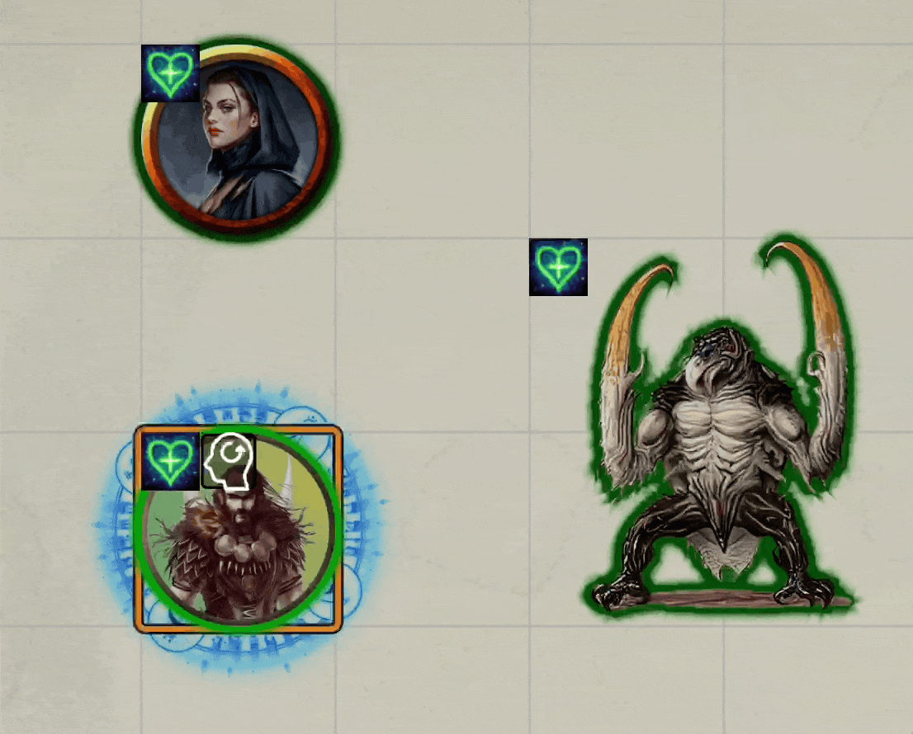
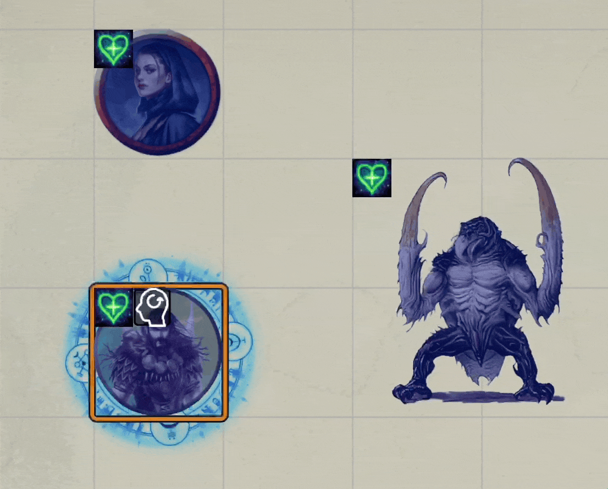
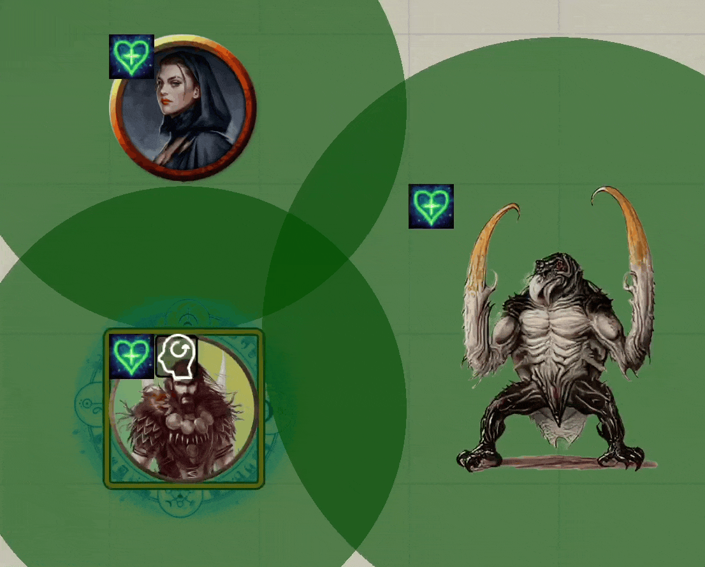

# Token Magic FX

There are (as of today, 7/14/22) sixty-two different token magic effects available on the DAE drop down.  Each of those provides a name but nothing else in terms of previewing.  This page contains a short (~5 second) GIF recording of each of those to make it easier to see what the effects do and perhaps spark idea on how to use them.

| 1. Bevel                                            | 2. Drop_Shadow                                       | 3. Adjustment                                    
:----------------------------------------------------:|:----------------------------------------------------:|:------------------------------------------------:
               |         |      
| 4. Outline                                          | 5. Glow                                              | 6. Bloom                                         
             |                |           
| 7. Distortion                                       | 8. Old-Film                                          | 9. Twist                                         
          |            |           
| 10. Bulge                                           | 11. Blur                                             | 12. Zoom Blur                                    
               |                |       
| 13. Shockwave                                       | 14. Zap Shadow                                       | 15. Rays                                         
        |       |         
| 16. Fog                                             | 17. Fumes                                            | 18. Electric                                     
              |            |     
| 19. Fire                                            | 20. Waves                                            | 21. Flood                                        
             |            |        
| 22. Smoke                                           | 23. Images                                           | 24. Chaos Images                                 
            |           |   
| 25. Spectral Images                                 | 26. Hexa Field                                       | 27. Fire Field                                     
  |  .    |   
| 28. Earth Field                                     | 29. Earth Field Top                                  | 30. Air Field                                     
      |  |     
| 31. Magic Field                                     | 32. Chromatic Field                                  | 33. Water Field                                   
      |  |   
| 34. Evil Field                                      | 35. Grid Field                                       | 36. Warp Field                                  
       |       |     
| 37. Color Field                                     | 38. Sunburst                                          | 39. Clover Field                                  
      |          |     
| 40. Scan                                            | 41. Blue Rays                                         | 42. Spectral Body                                  
             |         |     
| 43. Mantle of Madness                               | 44. Drift in Plains                                   | 45. Fire Aura                                  
|   |     
| 46. Glacial Aura                                    | 47. Anti Aura                                         | 48. Pure Fire Aura                                  
     |         |     
| 49. Pure Fire Aura 2                                | 50. Pure Ice Aura                                     | 51. Pixelate                                  
 |     |     
| 52. Fire v2                                         | 53. Fire v2 Chromatic                                 | 54. Fire-v2-Sparks.gif                                  
          | |     
| 55. Fire v2 Coldfire                                | 56. Fire v2 Blackfire                                 | 57. Super Frost                                  
 | |     
| 58. Super Heat                                      | 59. Evade Stance                                      | 60. Saving Roll (No Repeat)                                 
       |      |     
| 61. Dodge Jump (No Repeat)                          | 62. Fairy Outline                                     | XXX                                 
       |     | This space intentionally blank   

### [All credits for this images are to Jeznar for his hard work](https://github.com/Jeznar/Jeznar/blob/main/README.md)
